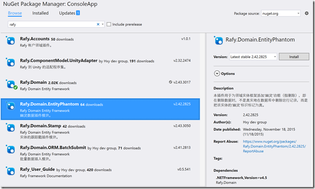
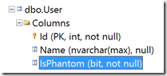

本文将解释 Rafy 框架中的幽灵插件的场景、使用方法、原理。  

##场景
在开发各类数据库应用系统时，往往需要在删除数据时不是真正地删除数据，而只是把数据标识为‘已删除’状态。这些数据在业务逻辑上是已经完全删除、不可用的数据，但是不能在数据库中真正的把它们删除，而是需要永久保留这些历史数据。即开发人员常说的‘假删除’功能。<br>
这种需求往往是系统级的。往往不是针对某一张表，而很可能是针对系统中的所有表都需要实现‘假删除’功能。

##使用方法
由于这种需求比较常见，所以我们决定专门为该功能写一个独立的 Rafy 插件。这样，开发人员需要实现假删除功能时，只需要引用该插件后，系统中所有删除的实体都自动变为‘幽灵’，同时这些幽灵数据在仓库的所有查询中都将被自动过滤。<br>
**步骤**
1. 通过 Nuget Package Manager 搜索并安装 Rafy.Domain.EntityPhantom 插件。

2. 在 DomainApp 中添加该插件：
```cs
class JXCApp : DomainApp
{
    protected override void InitEnvironment()
    {
        //添加幽灵插件到 Rafy 应用程序集中。
        RafyEnvironment.DomainPlugins.Add(new Rafy.Domain.EntityPhantom.EntityPhantomPlugin());
        RafyEnvironment.DomainPlugins.Add(new JXCPlugin());

        base.InitEnvironment();
    }
}
```
3. 为需要幽灵功能的实体打开该功能，需要在实体元数据配置中进行配置：
```cs
internal class UserConfig : JXCEntityConfig<User>
{
    protected override void ConfigMeta()
    {
        Meta.MapTable().MapAllProperties();

        //在实体配置中加入此行代码，为实体启用幽灵功能。
        Meta.EnablePhantoms();
    }
}
```


##效果
经过上面几步的配置，User 实体类就已经开启了幽灵功能。开启后，对实体会有以下的影响：
 - 所有继承自 Entity 的实体都会统一的添加一个 IsPhantom 的属性。这个属性表示这个实体是否为‘幽灵’，即已经删除的数据。
 - 开发者可以使用 Meta.EnablePhantoms() 来为某个指定的实体类型开启‘幽灵’功能。
 - 开启该功能的实体的 IsPhantom 属性会自动映射到数据库中。
 - 在保存实体时，如果要删除一个聚合实体，则这个聚合中的所有实体都将会被标记为‘幽灵’状态。
 - 在查询实体时，所有的查询，都将会自动过滤掉所有‘幽灵’状态的数据。（手写 SQL 查询的场景不在考虑范围内。）
 - 使用批量导入数据插件进行数据的批量导入时，批量删除的实体同样都会被标记为‘幽灵’状态。<br>
运行程序后，数据库中的字段，已经自动添加上 IsPhantom 字段了：

在使用 GetAll 查询所有实体时，框架自动加上一 IsPhantom = false 的过滤条件：

```cs
SELECT *
FROM [User]
WHERE [User].[IsPhantom] = @p0
ORDER BY [User].[Id] ASC
Parameters:False
 ``` 

数据的删除，变为更新表中对应行的 IsPhantom 字段为 True：

```cs
UPDATE [User] SET [Name] = @p0,[IsPhantom] = @p1 WHERE [Id] = @p2
Parameters:"Name",True,3
 ``` 


##原理
幽灵插件的原理比较简单。在 Rafy 框架的基础上，以插件的形式对 Rafy 框架中实体的数据层进行了扩展。在启用实体的幽灵功能后，该实体的 DataProvider 类型的 Deleting、Querying 事件都会被监听并扩展：

```cs
/// <summary>
/// 数据的删除、查询的拦截器。
/// </summary>
internal static class PhantomDataInterceptor
{
    internal static void Intercept()
    {
        RepositoryDataProvider.Deleting += RepositoryDataProvider_Deleting;
        RepositoryDataProvider.Querying += RepositoryDataProvider_Querying;
    }
}
 ``` 

在查询时，框架自动分析出当前查询的 SQL 树，并在主查询上加上 IsPhantom = false 的过滤条件。

##参见
其他资源
[Rafy 框架 - 幽灵插件（假删除）](http://www.cnblogs.com/zgynhqf/p/5086644.html)
