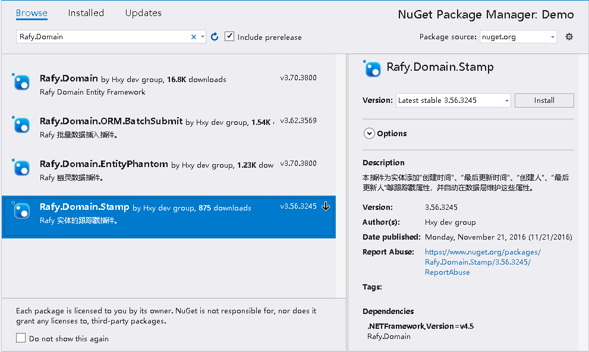
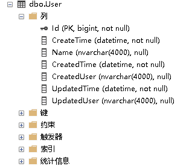

本文将解释 Rafy 框架中的时间戳插件的场景、使用方法、原理。  

##场景
在开发各类数据库应用系统时，业务领域实体往往需要包含“创建时间”、“最后更新时间”、“创建人”、“最后更新人”等跟踪戳属性。这些属性是领域实体的基本属性，几乎所有的领域业务操作都会使用到这些属性，如：创建业务数据肯定会保存创建时间、创建人；更新业务数据需要记录最后更新时间；查询业务数据需要显示创建人等。<br>
时间戳插件可以自动在数据层维护这些属性，使开发人员专注与业务逻辑开发，减少业务无关基本操作所占用的时间。

##使用方法
开发人员在业务领域实体实现时间戳功能时，只需要引用该插件。引用后系统中所有实体都会自动添加时间戳属性，同时仓库中所有数据库操作都会增加时间戳属性。<br>

**步骤**

1. 通过 Nuget Package Manager 搜索并安装 Rafy.Domain.Stamp 插件。
  
2. 在 DomainApp 中添加该插件：
```cs
class JXCApp : DomainApp
{
    protected override void InitEnvironment()
    {
        //添加时间戳插件到 Rafy 应用程序集中。
        RafyEnvironment.DomainPlugins.Add(new Rafy.Domain.Stamp.StampPlugin());
        RafyEnvironment.DomainPlugins.Add(new JXCPlugin());

        base.InitEnvironment();
    }
}
```
*添加时间戳插件后，默认所有实体自动注册时间跟踪戳属性。*


##效果
经过上面两步设置，User 实体类就已经开启了时间戳跟踪功能，并对实体会有以下的影响：
 - 所有继承自 Entity 的实体都会统一添加四个跟踪戳字段。
 运行程序后，数据库中的字段，已经自动添加上跟踪戳字段了：
  
 - 执行保存实体时，框架自动给跟踪戳字段赋值。
```cs
INSERT INTO 
    [User] ([CreatedTime],[CreatedUser],[UpdatedTime],[UpdatedUser],[CreateTime],[Name]) 
VALUES 
    ('2016-07-18 15:14:45','','2016-07-18 15:14:45','','2000-01-01 00:00:00','用户1')
```
*在用户已登录的情况下，Rafy会从前上下文中获取当前用户身份，并给CreatedUser、UpdatedUser字段赋值*


##原理
在 Rafy 框架的基础上，以插件的形式对 Rafy 框架中实体的数据层进行了扩展。在Rafy运行环境中加入时间戳插件后，领域中的所有实体默认注册四个跟踪戳属性；同时数据层拦截的提交操作，在添加、更新实体时，设置实体的跟踪戳。

```cs
/// <summary>
/// 拦截数据层的提交操作。在添加、更新实体时，设置实体的跟踪戳。
/// </summary>
public class StampSubmitInterceptor : SubmitInterceptor
{
	/// <summary>
    /// 提交指定的实体，并在添加、更新实体时，设置实体的跟踪戳。
    /// </summary>
    /// <param name="e">The e.</param>
    /// <param name="link">The link.</param>
    protected override void Submit(SubmitArgs e, ISubmitInterceptorLink link)
    {
    	//...
    	ResetStamp(e);
    	//...
    }
    internal static void ResetStamp(SubmitArgs e)
    {
    	...
        switch (e.Action)
        {
            //...
            case SubmitAction.Update:
                var entity = e.Entity;
                entity.SetUpdatedTime(DateTime.Now);
                var user1 = RafyEnvironment.Identity;
                entity.SetUpdatedUser(user1.Name);
                break;
            case SubmitAction.Insert:
                var entity2 = e.Entity;
                var now = DateTime.Now;
                entity2.SetUpdatedTime(now);
                entity2.SetCreatedTime(now);
                var user2 = RafyEnvironment.Identity;
                entity2.SetUpdatedUser(user2.Name);
                entity2.SetCreatedUser(user2.Name);
                break;
            //...
        }
    }
}
```
