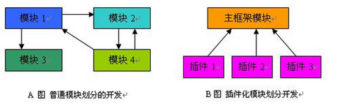

插件化架构是产品线可变性管理的基础。每一个独立的业务，都应该在一个单独的插件程序集内开发。

  

##插件的分类
插件分为领域插件和界面插件：领域插件中包含所涉及到的领域实体、领域服务；界面插件则包含需要显示的界面元素（界面插件又分两类：WPF 界面插件、Web 界面插件）。
 - 领域插件
  领域插件类型需要从`Rafy.DomainPlugin`类继承。
 - 界面插件
  界面插件类型需要从`Rafy.UIPlugin`类继承。

##插件的加载及启动顺序
应用程序最终由多个插件构成，而每一个插件程序集，都会严格按照启动顺序进行加载。这是因为启动级别越高，重用级别越高。例如：主版本重用、部分版本重用、定制化这三种重用级别分别对应
[产品线工程](../设计理念\产品线工程.html)
中的 721，所以应该把主版本重用的插件放在前面，定制化的插件放在后面。  
一个开发完成的插件，要加载到主程序中，有两种方式：
 - 运行时加载方式  
  这是一般的插件加载方式，需要通过 app.config 中指定需要使用到的插件程序集，系统在启动时会自动加载该目录下的所有插件。  
  下面是 app.config 中的示例插件配置：

 ```cs
<rafy currentCulture="zh-CN" collectDevLanguages="IsDebugging">
    <domainPlugins>
        <add plugin="Rafy.Customization"/>
        <add plugin="Rafy.DiskCaching"/>
        <add plugin="Rafy.MultiLanguages"/>
        <add plugin="Rafy.RBAC.Old"/>
        <add plugin="JXC"/>
    </domainPlugins>
    **
        <add plugin="Rafy.Customization.WPF"/>
        <add plugin="Rafy.MultiLanguages.WPF"/>
        <add plugin="Rafy.DevTools.WPF"/>
        <add plugin="Rafy.RBAC.Old.WPF"/>
        <add plugin="JXC.WPF"/>
        <add plugin="Demo"/>
    **
</rafy>
 ```

对于领域插件：如果是 C/S 程序，则客户端和服务端都需要部署。  
对于界面插件：如果是 C/S 程序，只需要部署到客户端；如果是 Web 开发，只需要部署到网站服务端。
 - 强制加载方式   
  一些对于系统来说，必须加载的插件程序集，可以使用程序加载方式。这种方式只需要在程序启动时，通过集合添加指定的插件即可。以下代码强制加载 JXCPlugin 插件：  
  另外，如果使用代码加载的方式，那么集合中的顺序则表示了插件的启动顺序。如下：

 ```cs
class DBIWebApp : DomainApp
{
    protected override void InitEnvironment()
    {
        RafyEnvironment.DomainPlugins.Add(new StampPlugin());
        RafyEnvironment.DomainPlugins.Add(new EntityPhantomPlugin());
        RafyEnvironment.DomainPlugins.Add(new AccountsPlugin());
        RafyEnvironment.DomainPlugins.Add(new RBACPlugin());
        RafyEnvironment.DomainPlugins.Add(new WFPlugin());
        RafyEnvironment.DomainPlugins.Add(new DBIPlugin());
        RafyEnvironment.DomainPlugins.Add(new VATEnginePlugin());
    }
}
 ```


##IPlugin 类型
在 Rafy 中，每个插件由一个单独的程序集来表示。而每个插件程序集中，必须有唯一一个插件类型，该类必须实现 IPlugin 接口：

```cs
namespace Rafy
{
    /// <summary>
    /// 插件定义。
    /// </summary>
    public interface IPlugin
    {
        /// <summary>
        /// 插件的初始化方法。
        /// 框架会在启动时根据启动级别顺序调用本方法。
        /// 
        /// 方法有两个职责：
        /// 1.依赖注入。
        /// 2.注册 app 生命周期中事件，进行特定的初始化工作。
        /// </summary>
        /// <param name="app">应用程序对象。</param>
        void Initialize(IApp app);
    }
}

```


##应用程序生命周期
插件的 Initialize 方法会在启动时根据启动级别顺序被调用。在该方法中，需要注册 app 生命周期中事件，进行特定的初始化工作。以下代码示例如果在运行时启动时，自动升级数据库：

```cs
public class JXCPlugin : DomainPlugin
{
    public override void Initialize(IApp app)
    {
        //在运行时启动时，自动升级数据库。
        app.RuntimeStarting += (o, e) => AutoUpdateDb();
    }

    /// <summary>
    /// 自动升级数据库。
    /// </summary>
    private static void AutoUpdateDb()
    {
        //...
    }
}
```

IApp 应用程序对象的生命周期如下：

```cs
/// <summary>
/// 应用程序生成周期定义
/// </summary>
public interface IApp
{
    /// <summary>
    /// 所有实体元数据初始化完毕，包括实体元数据之间的关系。
    /// </summary>
    event EventHandler AllPluginsIntialized;

    /// <summary>
    /// 所有初始化期定义的元数据初始化完成时事件。
    /// </summary>
    event EventHandler MetaCompiled;

    /// <summary>
    /// 模块的定义先于其它模型的操作。这样可以先设置好模板默认的按钮。
    /// </summary>
    event EventHandler ModuleOperations;

    /// <summary>
    /// 模块的定义完成
    /// </summary>
    event EventHandler ModuleOperationsCompleted;

    /// <summary>
    /// 所有初始化工作完成
    /// </summary>
    event EventHandler AppModelCompleted;

    /// <summary>
    /// 应用程序运行时行为开始。
    /// </summary>
    event EventHandler RuntimeStarting;

    /// <summary>
    /// AppStartup 完毕
    /// </summary>
    event EventHandler StartupCompleted;

    /// <summary>
    /// 应用程序完全退出
    /// </summary>
    event EventHandler Exit;

    /// <summary>
    /// 主过程开始前事件。
    /// </summary>
    event EventHandler MainProcessStarting;

    /// <summary>
    /// 关闭应用程序
    /// </summary>
    void Shutdown();
}
```


##其它
关于插件生命周期的设计，参见：  
[使用“管道”与“应用程序生命周期”重构：可插拔模块](http://www.cnblogs.com/zgynhqf/archive/2011/02/22/1961081.html)。
