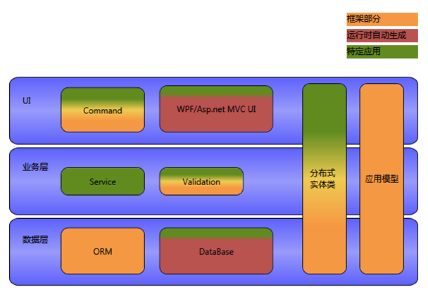
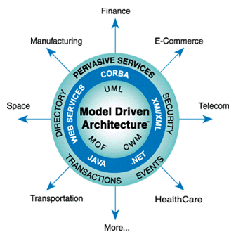
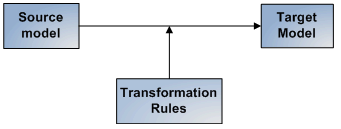
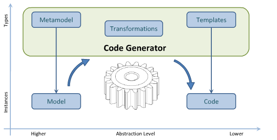

为了实现整个程序的可配置性，框架使用了模型驱动架构（Model Driven Architecture，MDA）的架构思想。    
Rafy 中，框架就是各类元数据，它们包括：领域实体元数据、界面元数据、ORM 元数据、其它零散元数据。与其它 MDA 的平台的不同在于，这些元数据完全由内存对象表示，并没有用 Xml 持久化。而这些元数据的配置，也主要是由代码进行配置（只有少部分元数据支持 Xml 配置），这样就使得开发人员可以封装更高级的配置函数，提高了开发效率。  

##领域实体元数据、ORM 元数据
领域实体元数据由类型 Rafy.MetaModel.EntityMeta 表示。它是实体框架运行时的基础，通过对它的配置，可以使得不同的实体表现出不同的行为。  
ORM 元数据是由 EntityMeta 中的一些属性表示的： EntityMeta.TableMeta、EntityPropertyMeta.ColumnMeta
等。  
对领域实体元数据及 ORM 元数据的配置，通过使用 Rafy.MetaModel.EntityConfig<T> 类型来完成。例如：

```cs
/// <summary>
/// 仓库 配置类。
/// 负责 仓库 类的实体元数据、界面元数据的配置。
/// </summary>
internal class WarehouseConfig : JXCEntityConfig<Warehouse>
{
    /// <summary>
    /// 配置实体的元数据
    /// </summary>
    protected override void ConfigMeta()
    {
        //启用客户端缓存。
        Meta.EnableClientCache();

        //配置实体的所有属性都映射到数据表中。
        Meta.MapTable().MapAllProperties();
    }
}
```


##界面元数据
界面元数据由类型 Rafy.MetaModel.View.EntityViewMeta表示（它的两个子类 Rafy.MetaModel.View.WPFEntityViewMeta 及 Rafy.MetaModel.View.WebEntityViewMeta
分别用于配置 WPF 界面及 Web 界面）。  
它是界面生动生成框架的输入。通过配置界面元数据，可以控制生成不同的界面。  
对界面元数据的配置，通过使用 Rafy.MetaModel.WPFViewConfig<T> 或 Rafy.MetaModel.WebViewConfig<T>
类型来完成。例如：

```cs
/// <summary>
/// 货品的视图配置。
/// </summary>
internal class ProductWPFViewConfig : WPFViewConfig<Product>
{
    protected override void ConfigView()
    {
        View.DomainName("商品").HasDelegate(Product.MingChengProperty);

        //界面生成时，使用以下命令
        View.UseDefaultCommands().UseCommands(typeof(ResetProductAmountCommand));

        //表单使用以下布局
        View.UseDetailPanel<ProductForm>();

        //表格中的属性，使用以下布局
        using (View.OrderProperties())
        {
            View.Property(Product.BianMaProperty)
                .HasLabel("编码").ShowIn(ShowInWhere.All).ShowInDetail(contentWidth: 0.7, columnSpan: 2);
            View.Property(Product.MingChengProperty)
                .HasLabel("名称").ShowIn(ShowInWhere.All).ShowInDetail(contentWidth: 600, columnSpan: 2);
            //...
        }
    }
}
```


##Rafy 模型驱动架构
下图是 Rafy 的多层结构图，在各层中，都有相应的元数据（应用模型）支撑。只有绿色的部分是需要开发人员编写的。
**模型驱动架构**



##附 - 模型驱动架构
**模型驱动架构 **




**模型转换**



**三大模型**


**代码生成**




关于模型驱动架构的详细概念，参考：《[MDA](http://www.omg.org/mda/)》。

##参见
其他资源  
[MDA](http://www.omg.org/mda/)