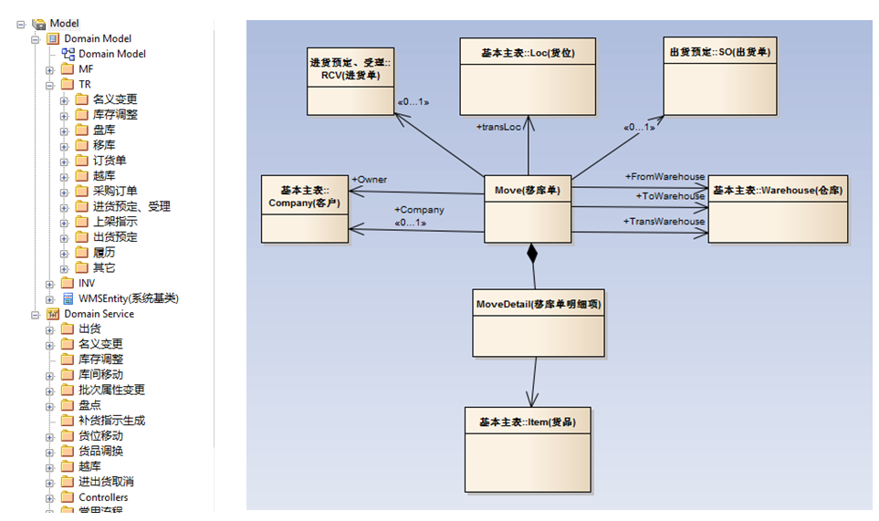
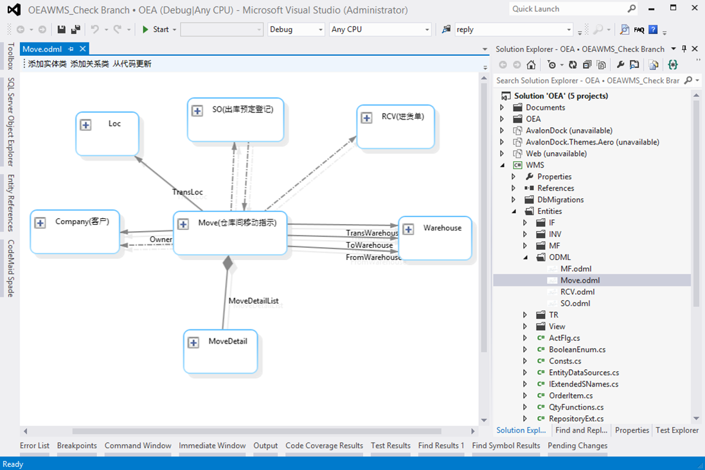
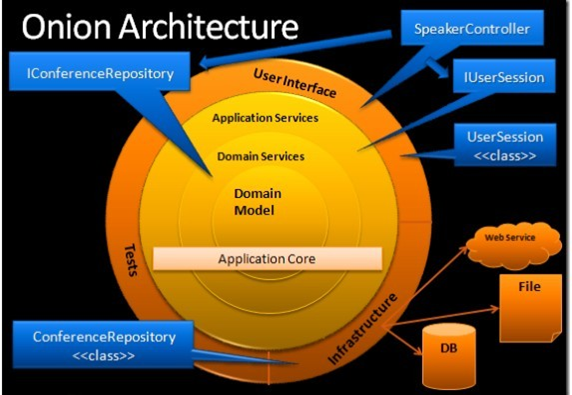
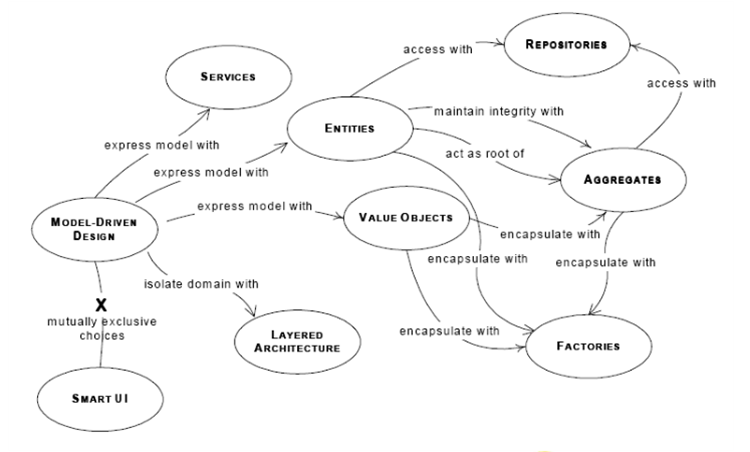
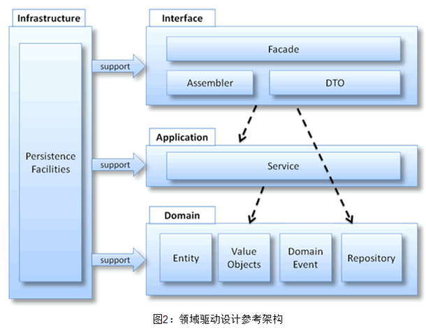

为了实现对复杂业务逻辑的处理，框架基于领域驱动设计（Domain Driven Design，DDD）的思想来构建。  

##领域实体驱动
框架中的领域实体是“富模型”，相对贫血模型而言，它不但有属性，而且还有关系，以及维护整个组合实体的行为。  
领域实体设计是整个系统设计的源头；基于实体，设计出相应的领域服务；然后再生成数据库；再生成界面。就可以快速地开发出完整的系统。关于领域实体的详情，见：
[领域实体](../领域实体框架\领域实体.html)    

开始领域实体编码前，需要先设计领域模型的 UML 关系图（类图）、领域服务的流程图（序列图）。然后再把 UML 图一对一转换为领域实体。以下是使用 EnterpriseArchitect(EA) 为某项目绘制的领域模型图：
**EA 中的领域模型 UML 图**

上图中的所有关系，都可以直接转换为领域实体。转换后，也可以直接在 VisualStudio 中查询相关实体的模型图，如：
**VisualStudio 中的领域模型 UML 图 **

关于如何使用 Visual Studio 中的 Rafy 领域模型图，见：
[领域实体关系图](../领域实体框架\领域实体\领域实体关系图.html)  

但是，Rafy 并没有完全按照经典 DDD 的概念来搭建。关于 Rafy 与经典 DDD 的关系，见：
[Rafy 与经典 DDD 的关系](../领域实体框架\其它\Rafy 与经典 DDD 的关系.html)  

##开发架构
Rafy 中的开发架构采用了洋葱架构思想：
**洋葱架构 **

关于此架构的详情，见：
[The Onion Architecture](http://jeffreypalermo.com/blog/the-onion-architecture-part-1/)。

##附 - 领域驱动设计
**DDD 组成部分**

**DDD 分层架构图 **

关于 DDD 的详细概念，见 Eric Evans 的：

《[Domain-Driven Design](http://book.douban.com/subject/1418618/)》。