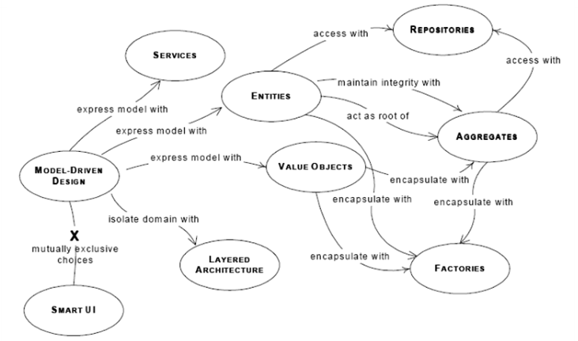
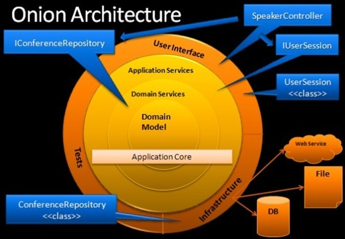

##DDD 简介
DDD 全名为 Domain Driven Design，即领域驱动设计。由 03 年 Evans 在书《[Domain Driven Design](http://book.douban.com/subject/1418618/)》中提出。DDD 包含以下概念：统一领域语言；应对复杂逻辑；快速应对变化；分层架构；实体；值对象；聚合；仓库；工厂；领域服务。如下图：  
**DDD组成部分**

 
后来，在这些基础概念之上，又发展了更多的领域设计模式，例如：CQRS、四色模型、事件溯源等。

##Rafy 框架与经典 DDD 对比
 - 统一领域语言   
     在使用 Rafy 领域实体框架开发应用时，必须保证使用统一的领域语言，这主要体现在实体类的名称上。Rafy 框架要求先通过 UML 完成领域模型的关系设计，在 UML 中，就必须对每一个实体定义固定的中英文名称。这些名称是后期沟通、开发的必备条件。

 - 应对复杂逻辑   
     Rafy 领域实体框架是基于 DDD 思想来进行开发的，目标之一就是需要处理非常复杂的业务逻辑。在使用一般的 ORM 框架时，由于没有对领域概念做特殊的处理，所以开发人员在开发业务逻辑时，还需要同时关系聚合、仓库、服务等概念的建立。而使用 Rafy 框架时，开发人员则可以专注于领域中业务逻辑的核心，处理复杂的业务逻辑。

 - 快速应对变化   
     支持。Rafy 领域实体框架使用 Code First 开发模式来提高开发效率，并支持数据库升级。 
       开发过程中，领域实体的属性是最常见的变化点。由于实体间的关系往往是固定的，所以使用 Rafy 框架开发时，只要求开发人员在 UML 图中画出实体间的关系即可，而不需要逐个地写出每个属性。具体的属性，在开发过程中会根据不断对业务逻辑理解的加深，再添加到实体上。这时，Rafy 会自动把字段同步到数据库中。  
       同时，不建议使用存储过程，而是把业务逻辑都写到领域服务中，这样在变更属性后，就可以很快地通过 Visual Studio 来定位需要变更的业务逻辑代码块。

 - 分层架构   
     支持。Rafy 是按照洋葱架构来组织代码，如图：

  **洋葱架构**

  

  应用代码按照 实体层、业务逻辑层、应用服务层、界面层进行分层开发，而框架帮助处理领域实体与数据库间的交互。

 - 实体    
     支持。实体是 DDD 中最重要的概念。Rafy 中的实体，支持标识 Id 属性，数据库中映射为自增长列；支持继承映射；支持树型实体。最方便开发人员的是，Rafy 中的实体为聚合、引用等实体关系做了大量的特殊处理，使得在开发时，可以非常方便地使用这些关系。  
       同时，Rafy 还要求某一类实体的集合定义一个单独的实体集合类型。这样，面向集合的业务逻辑，则可以编写在集合这个类型中。  
       标识：每个实体类都从 Entity 类继承，而 Entity 类中声明了实体的标识属性 Id。

 - 聚合   
     支持。Rafy 中组合其实就是 DDD 中的聚合概念。经典 DDD 中聚合规定：聚合有明确的边界、聚合根一旦消亡，整个聚合也结束了它的生命周期。Rafy 中的组合也有相同的逻辑。按照这个逻辑，它其实就 UML 规范中的组合关系，所以 Rafy 中也称之为组合，这样可以与 UML 规范中松散的聚合关系（非父子关系的一对多关系）区分开来。  
       而与经典 DDD 的区别在于：经典 DDD 要求对聚合中的子实体的访问，必须通过聚合根对象，以实现聚合的整体化概念；但是 Rafy 中对组合的访问则不需要遵守这一点，可以直接获取组合中的子实体，并对其进行相应的 CDU 操作，这样大方便了开发人员。

 - 值对象   
     不支持。目前不支持自定义值对象。只支持简单的枚举类型。

 - 仓库   
     支持。所有对实体的保存、查询操作，都是通过仓库来完成的。仓库基类已经实现了实体的保存操作和一些通用的实体查询方法（如查询所有实体、查询指定 Id 的实体等）。而开发人员自定义的实体查询方法，也都必须定义并实现在仓库类中。

 - 工厂   
     不支持工厂。在 Rafy 中，工厂没有设计为一个单独的类型，而是由仓库类来担当它的职责，也就是说可以使用仓库来创建一个实体对象。考虑到方便性，开发人员也可以直接使用 new 操作符直接来创建实体。

 - 领域服务   
     支持。领域服务是 Rafy 领域实体框架中的重要概念。它不但用于编写经典 DDD 中要求的跨聚合的业务逻辑，同时也是一个业务逻辑的独立封装体，是 Rafy 中 SOA 架构的基础。

 - Command Query Responsibility Segregation（命令查询职责分离，简称 CQRS）   
     支持。领域服务中编写跨组合的业务逻辑时，必须完全使用领域实体来实现，此即命令。而在仓库中编写的查询方法，除了可以返回实体外，也可以直接使用 Sql 查询并返回复杂的表格数据。

 - 其它   
     在 Rafy 中只支持以上的最常用的 DDD 概念，而象“事件溯源”等一些使用场景非常有限的设计模式，则不会支持。
