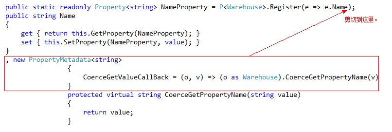

本节简要说明 Rafy 框架中目前提供的所有代码段及使用方法。  

##说明
代码段是 VisualStudio 提供的辅助开发的功能。使用代码段可以方便地生成小段的代码。<br>
Rafy 框架提供了大量的代码段，以方便日常开发。

##安装
安装 SDK 后，在 VisualStudio 菜单栏中点击 工具 -> 安装/卸载代码段，在弹出窗口中点击确定即可。安装完成并重新启动 VisualStudio 后，代码段就会生效了。

##属性代码段
对于开发人最常写的属性代码，提供了以下代码段：
 - Rafy_Property   
  用于编写实体的一般属性。

 - Rafy_Property_PropertyChanged   
  用于编写实体属性的变更后逻辑。
  需要注意的是，这个代码段并不生成完整的属性代码，而是只生成差异部分。使用方法如下：

  

 - Rafy_Property_PropertyChanging   
  用于编写实体属性的变更前逻辑。使用方法同：Rafy_Property_PropertyChanged。

 - Rafy_Property_CoerceGetValue   
  用于编写实体属性的强制 Get 逻辑。使用方法同：Rafy_Property_PropertyChanged。

 - Rafy_PropertyLOB   
  用于编写实体的大对象属性。

 - Rafy_PropertyReadOnly   
  用于编写实体的只读属性。

 - Rafy_PropertyRedundancy   
  用于编写实体的冗余属性。

 - Rafy_PropertyReference   
  用于编写实体的引用属性。

 - Rafy_PropertyReferenceNullable   
  用于编写实体的可空引用属性。

 - Rafy_PropertyList   
  用于编写实体的组合子属性。

 - Rafy_PropertyList_Full   
  用于编写完整的实体的组合子属性。  
  以上代码段都可以使用缩写来方便调用，例如，Rafy_PropertyReferenceNullable 只需要输入 RPR 即可。

##其它代码段
 - Rafy_Query   
  用于在仓库类中生成简单的查询方法。

 ```cs
[RepositoryQuery]
public virtual $EntityListName$ $MethodName$($Parameters$)
{
    var q = this.CreateLinqQuery();
    q = q.Where(e => e.$WhereExpression$);$end$
    return ($EntityListName$)this.QueryData(q);
}
 ```

 - Rafy_Query_Common   
  用于在仓库类中生成一个用于精确匹配每一个属性的查询方法。
 - Rafy_Query_TableQueryContent    
  用于在 Rafy_Query 生成的查询方法中，再生成一个使用 SqlTree 进行查询的查询实现代码。
