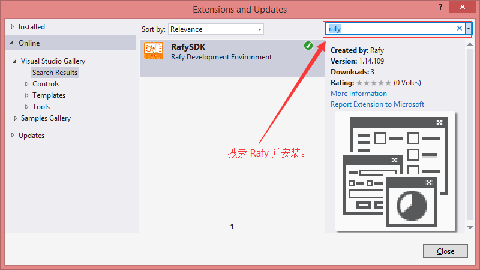
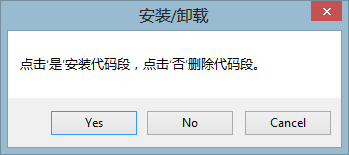

安装说明  

##SDK 安装步骤
****
1. 安装 Rafy SDK
  在 VisualStudio 中打开扩展管理器（Tools -> Extensions and Updates），选择在线项目，并搜索 “Rafy” 安装即可。如下图：
  

2. 安装开发代码段
  在安装扩展包完成后，打开 VS2012，点击菜单：工具-&gt;安装/卸载代码段。弹出**提示窗口**：

  

  点击**是**，弹出提示：“操作完成，可能需要重启 VS 后才能生效，是否打开代码段文件夹检查？”，点击“是”，打开 VS 代码段文件夹，检查是否已经拷贝进代码段，代码段列表见：[代码段](../领域实体框架\其它\代码段.html)。此时，完成代码段安装。

3. 重启 VisualStudio
  重启 VisualStudio 后，代码段才会生效。
