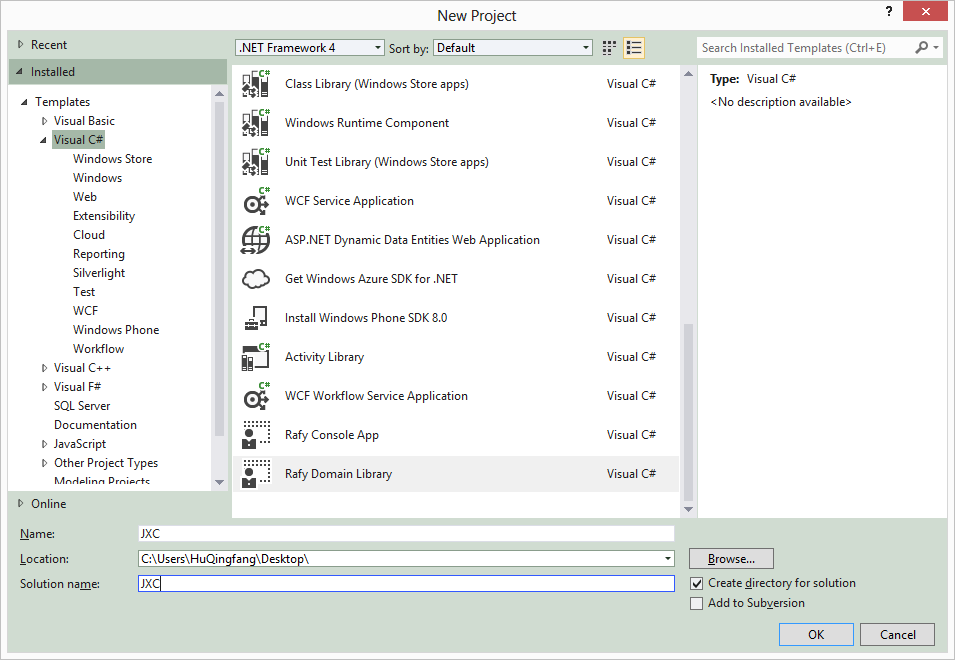
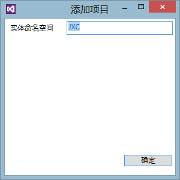
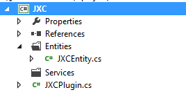
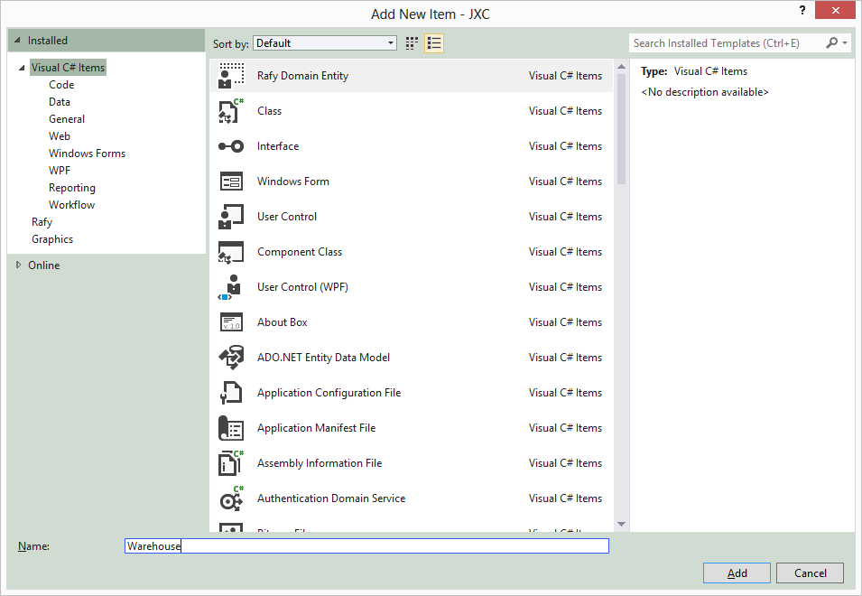
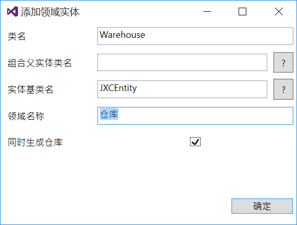
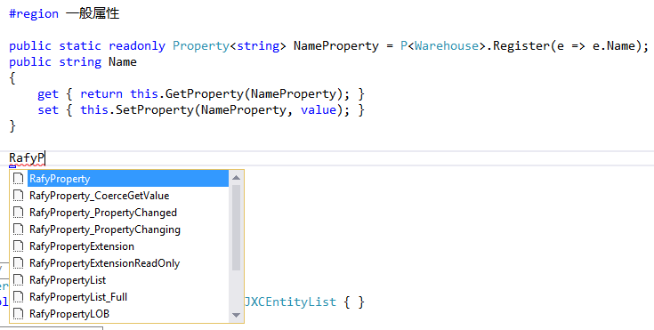
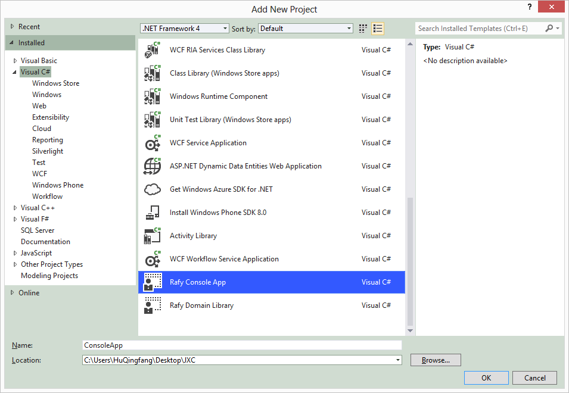
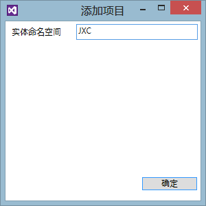

创建你的第一个 Rafy 应用程序  

##说明
通过完成本示例，你将学会如何建立一个领域实体程序集，并建立一个应用层程序使用这些领域实体，完成数据的增删改查。
本示例使用 SQLCE 作为示例的数据库。你也可以使用其它的数据库，详情参见：[多数据库支持](../../领域实体框架\ORM\多数据库支持.html)。

##环境
运行此示例需要安装以下组件：
 - Visual Studio 2012
 - [Rafy SDK](../../领域实体框架\安装.html)

##建立领域实体程序集
本节中，你将会为“进销存”管理系统建立一个对应名为 JXC 的领域实体程序集。
**步骤**      <br>

1. 新建项目  
  点击新建项目，在 Visual C# 项目类型中找到“Rafy Domain Library”，名称中填入："JXC"，选择项目位置后，点击确定。

  

2. 这时，会弹出**添加项目**窗口。在此窗口中，填写实体命名空间为 JXC，点击确定。

  

3. 文件检查  
  至此，VS 会创建一个名为 JXC 的解决方案，其中包含了一个名为 JXC 的 C# 程序集。如图：

  

  JXC 程序集中包含了以下内容：**Entities **文件夹
 - **/Entities/** 文件夹：用于存放所有实体类。                                        
 - **/Entities/JXCEntity.cs** ：将作为 JXC 领域空间下所有实体类的基类。参见：[领域实体](../../领域实体框架\领域实体.html)。                                        
 - **/JXCPlugin.cs** ：领域插件主文件。参见：[插件化架构](../../设计理念\插件化架构.html)。                                        
     编译整个解决方案，提示编译成功。

##添加实体类
本节将会在领域项目中添加实体类：仓库实体。
**步骤**  <br>
1. 添加领域实体类文件  
  在**Entities**文件夹上点击右键，选择添加-添加项，在弹出的**添加项**窗口中，选择`Rafy Domain Entity`项，并在名称中输入：“Warehouse"。点击添加。如图：

  

2. 这时，弹出**添加领域实体**窗口。修改**领域名称 **项为“仓库”，勾选：“同时生成仓库”（该选项会把实体的仓库也生成在同一个文件中），点击确定。如图：

  

3. 在实体中添加一般属性  
  在打开的**Warehouse.cs **代码编辑器中，找到并展开**一般属性 **代码区域。

   在这个区域块中，输入**RafyP**，VisualStudio 会立刻显示以 RafyP 开头的代码段（相关内容，参见：[代码段](../../领域实体框架\其它\代码段.html)如下图：  

  

  选择 RafyProperty，并按下 Tab 键。在生成的代码中录入类型为**string**、名称为**Name**的属性。这时，会生成以下代码：
  ```csharp
  public static readonly Property<string> NameProperty = P<Warehouse>.Register(e => e.Name);
  /// <summary>
  /// 名称
  /// </summary>
  public string Name
  {
  	get { return this.GetProperty(NameProperty); }
  	set { this.SetProperty(NameProperty, value); }
  }
  ```
4. 编译解决方案  
  这时，编译解决方案，提示成功。

##建立控制台程序集
本节中，你将会创建一个控制台应用程序。它使用刚才创建的 JXC 的领域实体程序集，来实现与用户的交互。
**步骤**<br>
1. 新建项目  
  在解决方案中右键，点击添加-新的项目，在弹出的**新建项目**窗口中，在 Visual C# 项目类型中找到“Rafy Console App”，名称中填入："ConsoleApp"，点击确定。

  

2. 这时，会弹出**添加项目**窗口。在此窗口中，填写实体命名空间为 JXC，点击确定。

  

  添加的控制台项目中有以下文件/文件夹：
 - **/amd64/** 文件夹：64位机的 SQLCE 程序集。                                        
 - **/x86/** 文件夹：32位机的 SQLCE 程序集。                                        
 - **/App.config** 文件：应用程序配置文件，其中主要包含了 JXC 空间中领域实体所映射的数据库连接；以及 SQLCE 数据库相关配置。                                        
 - **/Program.cs** 文件：应用程序入口文件。                                        
3. 在 ConsoleApp 项目中添加 JXC 实体项目的引用。
4. 编译并运行解决方案  
  这时编译整个解决方案，会提示编译成功。  
  设置 ConsoleApp 为启动项目，按 Ctrl+F5 运行程序。程序成功运行。  
  控制台项目只是一个示例，展示如何在应用程序中使用领域实体类。你可以在任意的应用程序中，添加与本项目类似的代码，也可以一样使用领域实体程序集。
  另外，控制台项目模板是为了方便 SQLCE 数据库的使用而创建的。如果你使用的是 SqlServer，则只需要手动引用 Rafy 程序集，并启动领域项目即可。

##使用领域实体
**步骤**
1. 在主函数中 new DomainApp().Startup(); 代码行后加入以下代码：

  ```cs
  var repo = RF.ResolveInstance<WarehouseRepository>();
  repo.Save(new Warehouse { Name = "Name" });
  var items = repo.CountAll();
  Console.WriteLine("实体存储成功，目前数据库中存在 {0} 条数据。", items);
  var list = repo.GetAll();
  foreach (var item in list)
  {
  	Console.WriteLine(item.Name);
  }
  ```
2. 运行整个项目  
   控制台中输出目前数据库中存在的数据条数，以及所有仓库的名称。  
   多次运行项目，会发现数据库中的数据条数不断添加。  
3. 查看生成的数据库  
  Rafy 内置了数据库的同步功能，所以在整个研发过程中，可以不需要进行任何数据库的开发。  
  打开 /ConsoleApp/bin/Debug/Data/ 目录，可以看到已经生成了一个 JXC.sdf 文件，这是一个 SQLCE 4.0 的数据库文件。  
  有关数据库生成的相关内容，参见：[数据库同步功能](../../领域实体框架\ORM\数据库同步功能.html)。  
  关于如何切换为使用 Sql Server 的相关内容，参见：[如何：连接到 Sql Server 数据库](../../领域实体框架\快速试用\如何：连接到 Sql Server 数据库.html)。

