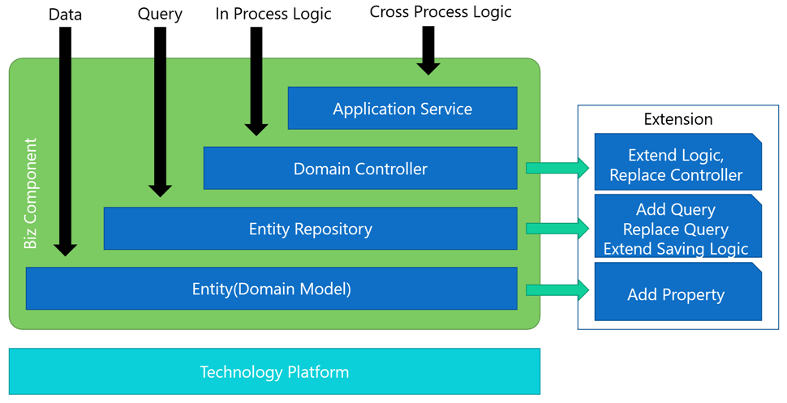

本章说明如何使用额外的插件（如客户化插件）对另一插件（如产品插件）进行扩展。  

##使用场景
在[产品线工程](../设计理念\产品线工程.html)中，项目的研发分为领域工程和应用工程。这个过程中会需要对领域工程中的内容进行大量的扩展。

##分层与扩展点
下图中显示了一个产品插件的逻辑分层，以及各层对应的扩展点。

##可扩展的内容
 - 实体属性扩展   
  可以为产品插件的实体添加新的实体属性，也可以修改现有属性的一些元数据。
 - 实体配置扩展  
  可以随意修改产品插件中的实体配置，如实体的数据库映射。
 - 实体查询的扩展   
  可以添加新的实体查询。可以修改、替换产品插件中现有的查询的实现。
 - 实体保存的扩展  
  可以扩展产品插件实体在保存时的行为。
 - 领域逻辑的扩展  
  可以添加新的领域逻辑，也可以修改、替换产品插件中现有的领域逻辑。
