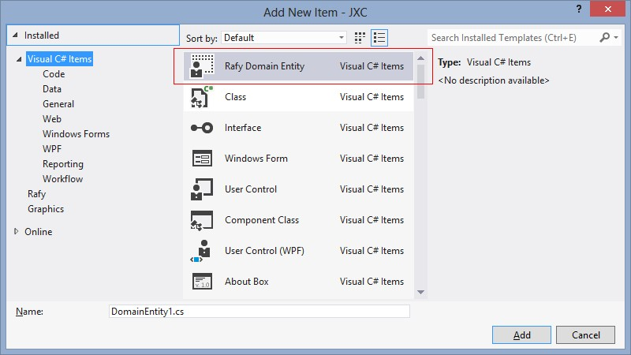
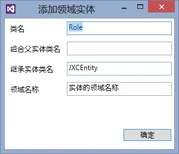

##简介
领域实体是实体框架中最重要的组件。
系统中所有实体类都必须直接或间接地从 `Rafy.Domain.Entity` 类继承。该基类的设计支持属性的管理、关系的延迟加载、自动冗余属性、大对象属性、树型关系等。详情见本节下各小节。

##创建实体
安装 SDK 后，可以使用模板来创建一个新的实体。在项目中添加项，选中 "Rafy Domain Entity"，命名为 Role.cs，点击确定：




在弹出的“添加领域实体”窗口中，填写相应的项：



各项说明：

 - 类名
    该项就是实体的名称。同时会影响实体列表类、实体仓库类的名称。
 - 组合父实体类名
    如果该实体不是一个组合根实体，那么需要指定它所属的组合父实体名。这样，可以自动为两个类创建关系属性。
 - 继承实体类名
    如果该实体是继承自某个特定实体，那么需要指定它的父实体名。
    由于每个实体项目在创建时，都会创建一个统一的基类。所以默认情况下，这里都使用该基类。例如这里是在 JXC 领域实体项目中添加实体，所以使用的默认是自动生成的 JXCEntity 实体基类。
 - 领域名称
    实体在领域中的名称。会生成到实体的注释中。
    这里填写的名称，也会显示到领域关系图中。见：[领域实体关系图](../领域实体框架\领域实体\领域实体关系图.html)。
    经过以下步骤，就编写了一个比较简单的实体类。以下代码是生成的实体类代码文件：

```cs
using System;
using System.Collections.Generic; 
using System.Linq;
using System.Runtime.Serialization;
using System.Security.Permissions;
using System.Text;
using Rafy;
using Rafy.Data;
using Rafy.Domain.ORM;
using Rafy.Domain;
using Rafy.Domain.Validation;
using Rafy.MetaModel;
using Rafy.MetaModel.Attributes;
using Rafy.MetaModel.View;
using Rafy.ManagedProperty;

namespace JXC
{
    /// <summary>
    /// 角色
    /// </summary>
    [RootEntity, Serializable]
    public partial class Role : JXCEntity
    {
        #region 构造函数

        public Role() { }

        [SecurityPermissionAttribute(SecurityAction.Demand, SerializationFormatter = true)]
        protected Role(SerializationInfo info, StreamingContext context) : base(info, context){ }

        #endregion

        #region 引用属性

        #endregion

        #region 组合子属性

        #endregion

        #region 一般属性

        public static readonly Property<string> NameProperty = P<Role>.Register(e => e.Name);
        public string Name
        {
            get { return this.GetProperty(NameProperty); }
            set { this.SetProperty(NameProperty, value); }
        }

        #endregion

        #region 只读属性

        #endregion
    }

    /// <summary>
    /// 角色 列表类。
    /// </summary>
    [Serializable]
    public partial class RoleList : JXCEntityList { }

    /// <summary>
    /// 角色 仓库类。
    /// 负责 角色 类的查询、保存。
    /// </summary>
    public partial class RoleRepository : JXCEntityRepository
    {
        /// <summary>
        /// 单例模式，外界不可以直接构造本对象。
        /// </summary>
        protected RoleRepository() { }
    }

    /// <summary>
    /// 角色 配置类。
    /// 负责 角色 类的实体元数据、界面元数据的配置。
    /// </summary>
    internal class RoleConfig : JXCEntityConfig<Role>
    {
        /// <summary>
        /// 配置实体的元数据
        /// </summary>
        protected override void ConfigMeta()
        {
            //配置实体的所有属性都映射到数据表中。
            Meta.MapTable().MapAllProperties();
        }
    }
}
```

其中包含四个类型，接下来说明实体的各组成部分。

##实体特性
实体必须标记以下特性：
 -                             如果是组合根实体，需要标记 Rafy.MetaModel.Attributes.RootEntityAttribute；非根实体，则标记 Rafy.MetaModel.Attributes.ChildEntityAttribute。                        
 -                             标记 System.SerializableAttribute 为可序列化实体，可支持分布式传输。                        

##构造函数
自动生成了两个实体的构造函数，一个用于外部直接构造实体，一个用于序列化。二者都不能被删除。

##实体属性
构造函数之后，是属性的代码区域。实体的属性是实体最重要的组成部分，分为四大部分，详见：
[引用属性](../领域实体框架\领域实体\实体属性\引用属性.html)、
[组合子属性](../领域实体框架\领域实体\实体属性\组合子属性.html)、
[一般属性](../领域实体框架\领域实体\实体属性\一般属性.html)、
[只读属性](../领域实体框架\领域实体\实体属性\只读属性.html)。

##实体列表类型
实体列表类是实体的一个集合类型。一般很少在其中编写代码，但是它在框架中起到非常重要的作用。详见：
[实体集合](../领域实体框架\领域实体\实体集合.html)。

##实体仓库类型
实体仓库类的职责是管理实体，并实现实体的持久化保存功能。详见：
[实体仓库](../领域实体框架\实体仓库.html)。

##实体配置类型
实体配置类型的职责是修改实体的元数据。详见：
[实体配置](../领域实体框架\领域实体\实体配置.html)。

##命名约定
实体类、实体列表类、实体仓库类必须满足以下命名约定：
 - 实体列表类名 = 实体类名 + "List"。
 - 实体仓库类名 = 实体类名 + "Repository"。
