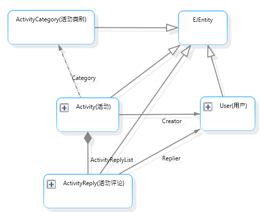
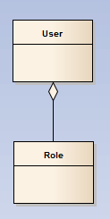
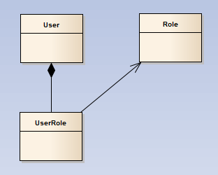

本节说明 Rafy 中实体间存在的几种关系，以及它们的使用场景。  

##关系图例
先来看一下 Rafy 中常用的几种关系：

 - 非空引用关系：连接实线。如图中的：Creator、Replier。
 - 可空引用关系：连接虚线。如图中的：Category。
 - 继承关系：以空心三角结尾的连接线。例如图中 Activity 到 EJEntity 的关系。
 - 组合关系：以实心三角结尾的连接线。如图中的：ActivityReplyList。
  有关 odml 关系图的内容，参见：[领域实体关系图](../../领域实体框架\领域实体\领域实体关系图.html)。

##继承
继承关系与 CLR 的继承关系一致。继承后，子实体类可获利父实体类的属性、方法。
关于实体继承后的数据表映射，详见：[继承映射](../../领域实体框架\ORM\继承映射.html)

##引用关系
引用关系是一种常用的多对一关系。可以表示诸如：“A使用B”、“A按B分类” 等概念。  
引用关系分可空引用、不可空引用。  
对于如果编写引用关系，参见：[引用属性](../../领域实体框架\领域实体\实体属性\引用属性.html)。

##组合
组合关系是一种一对多关系，是最常用的一种主从关系。它表示一个实体类从属于另一实体类，两个实体类组合在一起，用于表示领域中一个具体的概念。

例如，在开发过程中，常常听说的主从表、主细表、父子表，都是这种结构。

这种关系对应 DDD 中的聚合关系，也对应 UML 中的组合关系。Rafy 中的组合实体，也就对应着 DDD 中的聚合实体。
组合的特点：
 - 从属关系。
 - 一个组合中的子对象，必须在组合根对象存在之后才能存在，否则没有意义。
 - 一旦组合根对象消亡，整个组合中的所有对象必须一同消亡。  
    到底使用聚合还是组合，设计时区分的主要原则是：如果父实体消亡时，子实体也必须消亡，那么使用组合关系，否则使用聚合关系。  
    但是这两种关系，在设计上并不是固定的。例如：汽车与轮胎，一般情况上是一起消亡的，所以使用组合。但是对于汽车生产企业来说，轮胎是可以先于汽车生产出来的，并可以独立存在，这时则不能使用组合。  
    在 Rafy 中，组合关系意味着组合父类可以获取组合子类的集合，同时组合子类可以获取其对应的组合父类的引用.  

    关系：如何编写代码来表示组合关系，参见：[组合子属性](../../领域实体框架\领域实体\实体属性\组合子属性.html)

##聚合
聚合关系是另一种一对多关系。相对于组合关系来说，聚合关系更加松散。 在 Rafy 中，这种关系并不直接被实现，而是把聚合转换为由组合和引用构成的。以下以用户与角色的关系设计为例说明。
用户与角色是多对多的，一个用户拥有很多角色，一个角色下也有很多的用户。 对于这两个一对多关系，在实体关系的设计上，我们需要先分辨两个实体间的依赖关系。这里，假设我们认为用户依赖角色，也就是先存在用户，才会存在角色。那么，我们认为是用户聚合了角色。UML 图如下：

在 Rafy 中，我们把聚合关系实体化：

用户组合了实体：UserRole，而 UserRole 非空引用了一个 Role。一旦删除用户，这个用户对应的 UserRole 组合子实体也将被删除。如果角色还被某个用户使用时，则不能删除这个角色。同时，我们可以为这个 UserRole 实体添加许多的属性，表示这个关系的属性。例如可以添加一个“添加时间”属性，用于表示为用户添加这个角色的时间。  
由于我们设计角色不依赖用户，所以不需要修改角色的实体结构。如果需要查找某个角色下的所有用户，则可以在角色的仓库类中添加相应的查询方法。应用层使用该方法来进行查询即可。仓库查询方法的编写，参见：[编写查询](../../领域实体框架/实体仓库/编写查询.html)