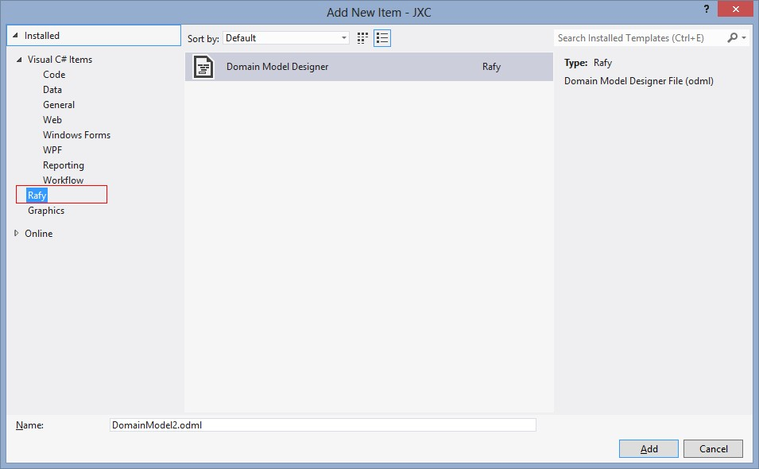
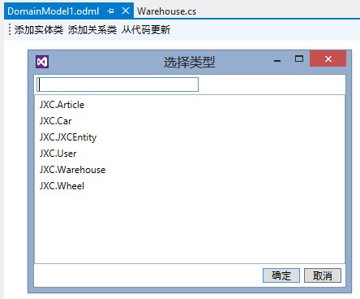
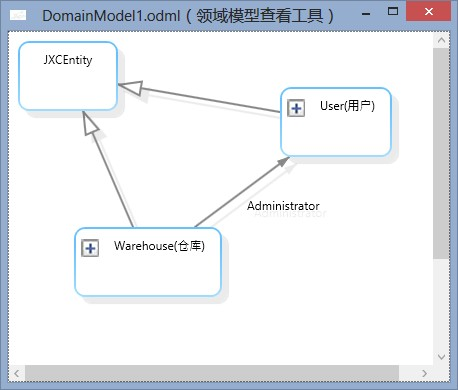

领域实体关系图以图形的形式来描述指定的部分实体及实体间的关系。  
要查看或创建领域实体关系图，需要安装 Rafy SDK。  

##使用领域实体关系图
**以下步骤显示如何使用领域实体设计器**
1. 创建领域实体关系图  
  在领域实体插件项目中添加新项，选择 Rafy 目录中的 Domain Model Designer 项，添加即可。  
  **添加新项窗口**

  
2. 添加实体  
  向图中添加实体可以有两种方式：  
 - 在解决方案浏览器中把想要显示的实体类直接拖到关系图中。

 - 点击添加实体类按钮，然后选择所需要的类型。

  
3. 添加关系类  
  选中添加到图中任意实体，点击“添加关系类”按钮，可以把项目中与该实体有关系的其它的实体也加入到图中来。  
  注意，建议一张图中，只加入一个组合（聚合）就行了，过多的组合会导致图形复杂、混乱。
4. 删除实体类  
  选中图中的任意多个实体，按“Delete”键删除。
5. 从代码更新  
  领域实体关系图的实体名、关系等信息，完全来自于项目中的 C# 源码。当一张图中的实体类对应的源码发生改变时，可以使用这个功能来更新其对应的关系。
6. 双击导航  
  双击图中的任意实体类，可以打开对应的代码文件。

##ODML 文件查看器
对于 .odml 文件，可以使用一个独立的“领域模型查看器”应用程序进行查看。这样方便在没有安装 VisualStudio 的电脑上查看领域模型。  

